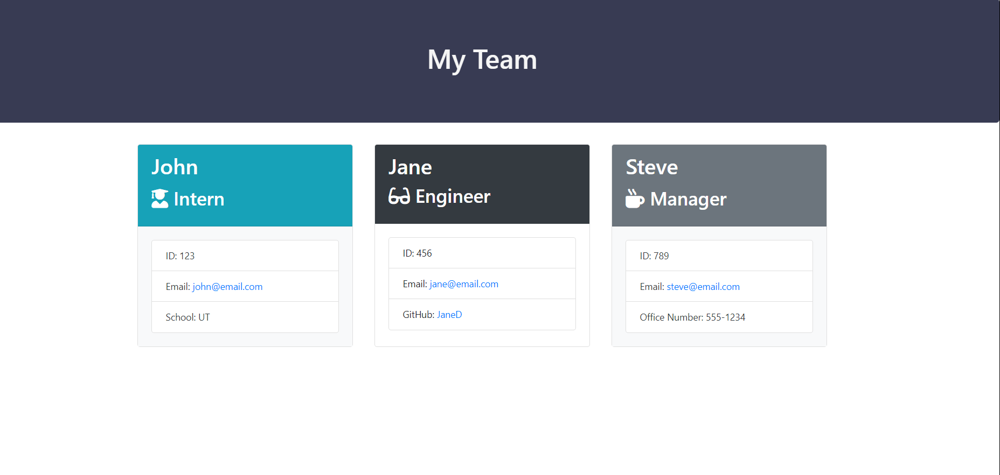

# OOP - DEPARTMENT ORG CHART TEMPLATE

### PROJECT DESCRIPTION

Build a Node CLI that takes in information about employees and generates an HTML webpage that displays the hierarchy of a department team, and includes summaries for each person. Since testing is a key piece in making code maintainable, you will also be ensuring that all unit tests pass. Ensure that the code is readable, reliable, and maintainable.

### USER STORE

As a manager:
I want to generate a webpage that displays my team's basic info
so that I have quick access to emails and GitHub profiles

### ACCEPTANCE CRITERIA

The project must prompt the user to build an engineering and generate a `team.html` page in the `output` directory, that displays a nicely formatted team roster. Each team member should display the following in no particular order:

  * Name
  * Role
  * ID

  * Role-specific properties:
      * Intern - school
      * Engineer - link to GitHub profile
      * Manager - office number

### MINIMUM APPLICATION REQUIREMENTS

* Functional application.

* GitHub repository with a unique name and a README describing the project.

* User can use the CLI to generate an HTML page that displays information about their team.

* All tests must pass

### WALKTHROUGH VIDEO:

### SCREENSHOT:

### DEMO URL:

https://drive.google.com/file/d/1ipCcaKPWiQx8beqgeB96LaRZtAawv1OS/view
